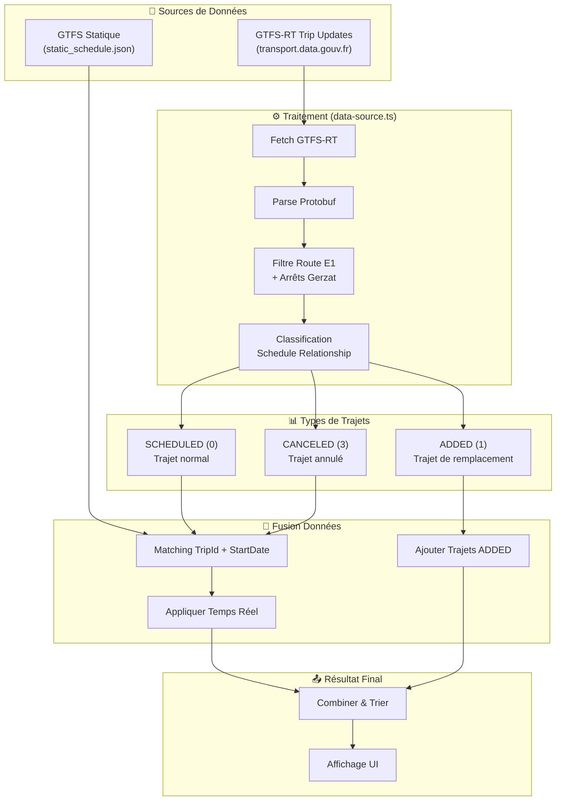
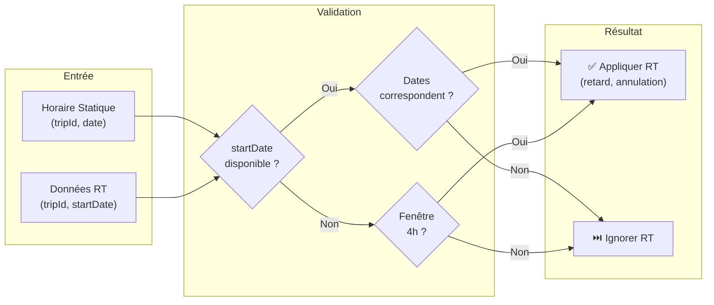

# 🚉 Gerzat Live - Hub Multimodal

Application Next.js pour suivre en temps réel les bus T2C et les trains TER à Gerzat.

[](https://gerzatlive.desimone.fr)
[](https://github.com/nickdesi/BusTrainGerzat)
[](https://coolify.io/)

<div align="center">
  
  
</div>

## 📍 Arrêts surveillés

| Transport | Arrêt / Gare | Ligne(s) |
|-----------|--------------|----------|
| 🚌 Bus T2C | **Gerzat Champfleuri** | Ligne E1 |
| 🚆 Train TER | **Gare de Gerzat** | TER Auvergne |

## 🚀 Fonctionnalités

### 🚌 Bus T2C (Ligne E1 - Arrêt Champfleuri)

- **Temps réel & Théorique** : Affichage précis des prochains passages avec distinction claire par badges de couleur.
- **Indicateurs de Retard** : Visualisation immédiate de l'état du trafic (À l'heure, En avance, Retard).
- **Directions Claires** : Séparation distincte entre les départs (Vers Aubière/Romagnat) et les arrivées (Terminus Gerzat).

### 🚆 Trains TER (Gare de Gerzat)

- **Suivi en Direct** : Horaires des trains en temps réel via l'API SNCF officielle.
- **Double Sens** : Affichage séparé des trains vers Clermont-Ferrand et vers Riom/Moulins.
- **Horaires Détaillés** : Affichage de l'heure d'arrivée ET de départ pour chaque train à Gerzat.
- **Détails du Train** : Numéro de train et statut du retard en temps réel.
- **Trains Annulés** : Détection et affichage des trains supprimés avec statut "ANNULÉ" en rouge.

### 🗺️ Carte Live (Ligne E1)

- **Position en temps réel** : Visualisation des bus sur une carte interactive avec le tracé de la ligne.
- **Estimation intelligente** : Positions estimées à partir des données GTFS-RT Trip Updates avec "Snap to Route".
- **Direction affichée** : 🟢 Vert = Vers Gerzat / 🔵 Bleu = Vers Aubière/Romagnat.
- **ETA au terminus** : Heure d'arrivée estimée au terminus pour chaque bus.
- **Prochain arrêt** : Nom de l'arrêt suivant et heure d'arrivée estimée.
- **Indicateur de retard** : Retard affiché en temps réel dans le popup.

### ✨ Expérience Utilisateur (UX/UI & Accessibilité)

- **Design Glassmorphism** : Interface sombre élégante avec effets de flou et de transparence.
- **Recherche & Favoris** : Filtrage instantané et favoris granulaires par trajet spécifique (bus/train à une heure précise).
- **Notifications de retard** : Alertes push pour vos trajets favoris en retard (≥5 min).
- **Accessibilité (A11y)** : Mode Daltonien (couleurs contrastées), navigation clavier optimisée (Skip Link) et attributs ARIA complets.

### 🧠 Intelligence Artificielle

- **Prédictions de Retard** : Badges "IA" indiquant les risques de retard basés sur l'historique (heures de pointe, sorties scolaires).
- **Alertes Intelligentes** : Bannière dynamique avertissant des perturbations probables sur vos trajets favoris dès l'ouverture.

### ⚡ Performance & Temps Réel

- **Server-Sent Events (SSE)** : Flux de données continu sans rechargement (plus de polling API).
- **Mises à jour Silencieuses** : Rafraîchissement instantané des horaires et statuts sans clignotement.
- **Cache Intelligent** : Stratégie network-first via Service Worker pour une PWA ultra-rapide.

## 🛠 Architecture Technique

- **Framework** : Next.js 16 (App Router)
- **Styling** : TailwindCSS v4
- **State** : TanStack Query (React Query)

### 🧩 Hooks modulaires (v2.5.0)

| Hook | Responsabilité |
|------|----------------|
| `useBusData` | Fetch données bus GTFS-RT |
| `useTrainData` | Fetch données train SNCF |
| `useDeparturesModel` | Transformation & tri |
| `useDepartures` | Composition des hooks ci-dessus |
| `useFavorites` | Gestion des favoris (localStorage) |
| `useDelayNotifications` | Notifications push retards |

### 📡 Sources de données

| Transport | API | Source |
|-----------|-----|--------|
| **Train TER** | API SNCF (Navitia) | [api.sncf.com](https://api.sncf.com) / [doc.navitia.io](https://doc.navitia.io) (clé requise) |
| **Bus T2C** | GTFS-RT temps réel | [transport.data.gouv.fr](https://proxy.transport.data.gouv.fr/resource/t2c-clermont-gtfs-rt-trip-update) |
| **Bus T2C** | GTFS statique | [opendata.clermontmetropole.eu](https://opendata.clermontmetropole.eu/api/v2/catalog/datasets/gtfs-smtc/alternative_exports/gtfs) |

### 🔄 Architecture des Données Bus GTFS-RT

Le système de gestion des données bus suit une architecture robuste qui combine les horaires statiques avec les mises à jour temps réel :



#### Logique de Matching RT/Statique



#### Gestion des Schedule Relationships

| Code | Nom | Description | Traitement |
|------|-----|-------------|------------|
| `0` | SCHEDULED | Trajet planifié normal | Mis à jour avec données RT |
| `1` | ADDED | Trajet ajouté (remplacement) | Créé dynamiquement, affiché même sans horaire statique |
| `2` | UNSCHEDULED | Trajet sans horaire fixe | Traité comme ADDED |
| `3` | CANCELED | Trajet annulé | Marqué "ANNULÉ" en rouge |

## 📦 Installation

1. **Installer les dépendances** :

    ```bash
    npm install
    ```

2. **Configurer les variables d'environnement** :

    ```bash
    # Créer le fichier .env.local
    echo "SNCF_API_KEY=votre_clé_api_sncf" > .env.local
    ```

    > Obtenez votre clé sur [digital.sncf.com](https://www.digital.sncf.com/startup/api)

3. **Lancer le serveur de développement** :

    ```bash
    npm run dev
    ```

4. **Accéder à l'application** :
    Ouvrir [http://localhost:3000](http://localhost:3000) dans votre navigateur.

## 🔧 Scripts Utiles

- **Build** : `npm run build` (Utilise Webpack pour la compatibilité PWA).
- **Mise à jour Bus (Manuelle)** :

  ```bash
  python3 generate_static_json.py
  ```

- **Mise à jour Train (Manuelle)** :

  ```bash
  python3 generate_train_static.py
  ```

## 🔄 Mise à jour automatique

Les horaires de bus T2C sont vérifiés **automatiquement chaque lundi** à 7h00 (heure de Paris) via GitHub Actions :

- **Vérification sentinelle** : Le script vérifie d'abord si les données officielles contiennent les nouveaux horaires (ex: départ de 05h53).
- **Protection des corrections manuelles** : Si les données officielles sont encore obsolètes, le workflow s'arrête sans modifier les horaires corrigés manuellement.
- **Mise à jour automatique** : Si les données officielles sont à jour, téléchargement GTFS et régénération du fichier `static_schedule.json`.

### Scripts disponibles

```bash
# Régénérer les horaires statiques depuis GTFS officiel
python3 generate_static_json.py

# Extraire les données géographiques (tracé, arrêts) pour la carte live
python3 extract_lineE1_data.py

# Vérifier si les données officielles sont à jour
python3 scripts/check_gtfs_update.py
```

> **Note** : Les données GTFS sont téléchargées automatiquement depuis [opendata.clermontmetropole.eu](https://opendata.clermontmetropole.eu/explore/dataset/gtfs-smtc).

Vous pouvez aussi déclencher la mise à jour manuellement depuis [GitHub Actions](https://github.com/nickdesi/BusTrainGerzat/actions).

## 📱 Installer l'Application sur Mobile

L'application peut être installée comme une app native sur votre téléphone !

### 🍎 iPhone / iPad

1. Ouvrez **Safari** et allez sur [gerzatlive.desimone.fr](https://gerzatlive.desimone.fr)
2. Appuyez sur l'icône **Partager** (carré avec flèche vers le haut)
3. Faites défiler et appuyez sur **« Sur l'écran d'accueil »**
4. Nommez l'app (ex: "Gerzat Live") et appuyez sur **Ajouter**

### 🤖 Android

1. Ouvrez **Chrome** et allez sur [gerzatlive.desimone.fr](https://gerzatlive.desimone.fr)
2. Appuyez sur les **3 points** en haut à droite
3. Appuyez sur **« Installer l'application »** ou **« Ajouter à l'écran d'accueil »**
4. Confirmez l'installation

Une fois installée, l'application apparaît sur votre écran d'accueil avec sa propre icône et fonctionne comme une app native !
