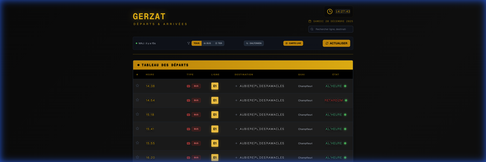
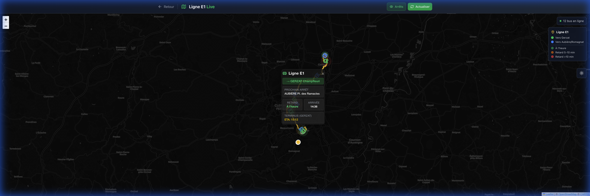

# 🚉 Gerzat Live

**Gerzat Live v3.7.3 • 2026**

Application web Next.js pour consulter rapidement les prochains passages des bus T2C et des trains TER à Gerzat, avec tableau temps réel, favoris, carte live de la ligne E1 et indicateurs de fraîcheur des données.

[](https://gerzatlive.desimone.fr)
[](https://github.com/nickdesi/BusTrainGerzat)
[](https://coolify.io/)

<div align="center">
  
  
</div>

## ✨ Objectif

Gerzat Live centralise les informations utiles avant un trajet depuis ou vers Gerzat : prochains départs, arrivées, bus T2C ligne E1, trains TER, favoris et carte live.

L’interface est mobile-first, sombre, lisible et pensée pour afficher immédiatement les informations prioritaires : horaire, retard, annulation, source temps réel et état de fraîcheur des données.

## 📍 Arrêts et gare surveillés

| Transport | Arrêt / Gare | Ligne(s) |
| --- | --- | --- |
| 🚌 Bus T2C | **Gerzat Champfleuri** | Ligne E1, toutes directions |
| 🚌 Bus T2C Express | **Le Patural** | Ligne E1, direction Ballainvilliers |
| 🚆 Train TER | **Gare de Gerzat** | TER Auvergne |

## 🚀 Fonctionnalités

### Tableau départs / arrivées

- Vue unifiée bus + TER.
- Horaires théoriques et temps réel.
- Statuts retard, avance, annulation et disponibilité live.
- Favoris persistants pour mettre en avant les trajets importants.
- Détail de trajet bus disponible au clic.

### Carte live ligne E1

- Carte Leaflet / React-Leaflet côté client.
- Fond Carto basemap clair/sombre.
- Tracé principal, branches, arrêts importants et véhicules actifs.
- Positions GPS GTFS-RT quand disponibles.
- Interpolation ou fallback horaire quand le temps réel est incomplet.

### Qualité et fraîcheur des données

- Endpoint de fraîcheur global pour T2C et SNCF.
- Détection des données GTFS T2C obsolètes.
- Statut SNCF/Navitia basé sur la présence de clé API, le cache et l’âge des dernières données.
- Tests unitaires sur les helpers critiques T2C/SNCF.

## 🧭 Architecture des données

### Bus T2C

Gerzat Live combine plusieurs niveaux de données pour garder l’affichage exploitable même si un flux est incomplet :

1. **GTFS statique** : horaires planifiés, arrêts, trips et données générées.
2. **GTFS-RT Trip Updates** : retards, annulations et prévisions temps réel.
3. **GTFS-RT Vehicle Positions** : positions GPS des véhicules quand disponibles.
4. **Fallback applicatif** : interpolation ou horaire théorique si un signal live manque.

La logique spécifique à la ligne E1 est centralisée dans `src/services/t2c-line-e1.service.ts` afin d’éviter la duplication entre `/api/vehicles`, `/api/trip/[tripId]` et les services métier.

### Trains TER / SNCF

- Intégration SNCF / Navitia via `SNCF_API_KEY`.
- Gestion du cache côté service pour limiter les appels et préserver l’affichage.
- Statut de fraîcheur exposé à l’application via `/api/freshness`.

## 📡 API internes

| Endpoint | Rôle |
| --- | --- |
| `/api/realtime` | Prochains départs bus E1. |
| `/api/trains` | Données TER SNCF/Navitia. |
| `/api/vehicles` | Véhicules E1 : GPS, interpolation ou fallback statique. |
| `/api/trip/[tripId]` | Détail d’un trajet bus E1. |
| `/api/lineE1` | Données statiques de la ligne E1 pour la carte. |
| `/api/freshness` | État de fraîcheur T2C + SNCF. |
| `/api/stream` | Flux serveur bus + TER pour rafraîchissement temps réel. |

## 🧠 Serveur MCP

Le projet expose un serveur **MCP (Model Context Protocol)** pour permettre à un agent IA d’interroger les données de transport.

Outils disponibles :

- `get_bus_positions` : positions GPS et cap des bus E1 ;
- `get_departures` : prochains départs, filtrables par type (`BUS`, `TRAIN`, `ALL`) ;
- `get_line_status` : résumé de ligne, nombre de véhicules et retard moyen.

```bash
npm run mcp
```

## 🛠️ Stack technique

- **Framework** : Next.js 16, App Router
- **Langage** : TypeScript
- **UI** : React 19, Tailwind CSS v4
- **Données client** : TanStack Query
- **Carte** : Leaflet 1.9, React-Leaflet 5
- **Validation** : Zod
- **Tests** : Jest, Testing Library
- **PWA** : manifest + service worker
- **Déploiement** : Coolify / Nixpacks

## 📂 Structure

```text
src/
├── app/              # Routes Next.js App Router et API
├── components/       # Composants React UI
├── components/map/   # Composants dédiés à la carte
├── hooks/            # Hooks de données et état local
├── lib/              # Clients API, GTFS-RT, logging, rate-limit
├── mcp-server/       # Serveur MCP
├── services/         # Services métier T2C, ligne E1 et SNCF
├── types/            # Types TypeScript partagés
└── utils/            # Formatage et helpers date
```

## 📡 Sources de données

| Transport | Type | Source |
| --- | --- | --- |
| Bus T2C | GTFS-RT temps réel | transport.data.gouv.fr |
| Bus T2C | GTFS statique | Clermont Métropole Open Data |
| Train TER | API SNCF / Navitia | api.sncf.com |

## 📦 Installation locale

Prérequis :

- Node.js `>= 24.15.0` ;
- npm ;
- une clé API SNCF / Navitia pour les trains ;
- Python `>= 3.13` uniquement pour régénérer les données GTFS.

Installer les dépendances :

```bash
npm install
```

Créer `.env.local` :

```bash
SNCF_API_KEY=votre_cle_api_sncf
```

Lancer le développement :

```bash
npm run dev
```

Puis ouvrir `http://localhost:3000`.

## 🔧 Scripts utiles

```bash
npm run dev      # serveur de développement
npm run build    # build production
npm run start    # serveur production
npm run lint     # analyse ESLint
npm run test     # tests Jest
npm run mcp      # serveur MCP
```

Validation complète recommandée avant publication :

```bash
npm run lint
npm test -- --runInBand
npm run build
```

## 🔄 Mise à jour des données T2C

Les données générées sont principalement :

- `gtfs_data/` : archive GTFS T2C extraite ;
- `src/data/static_schedule.json` : horaires statiques consommés par l’app ;
- `src/data/gtfs_config.json` : configuration arrêts/routes ;
- `public/data/e1_stop_times.json` : trips et stop times E1 pour carte et détails.

Régénération locale :

```bash
python3 scripts/gtfs/check_gtfs_update.py
python3 scripts/gtfs/generate_static_json.py
python3 scripts/gtfs/generate_e1_stop_times.py
```

Le workflow GitHub Actions `Update T2C GTFS Schedule` exécute automatiquement cette chaîne, valide les JSON générés, lance lint/tests/build, puis commit uniquement si les données changent.

## ✅ CI et qualité

Le workflow `CI` s’exécute sur `main` et sur les pull requests :

1. installation via `npm ci` ;
2. lint ESLint ;
3. tests Jest en série ;
4. build Next.js.

Les tests couvrent notamment :

- les helpers ligne E1 et la correspondance fuzzy des trip IDs ;
- les règles de filtrage/remplacement T2C ;
- la fraîcheur SNCF/Navitia ;
- les helpers de date, formatage, API client et interpolation véhicule.

## 🚢 Déploiement

Le projet est compatible Coolify via `nixpacks.toml`.

Versions alignées :

- Node.js `24.15.0` en local, CI et Nixpacks ;
- Python `3.13` dans le workflow de mise à jour GTFS ;
- Next.js `16.2.x` et React `19.2.x`.

Variables d’environnement requises en production :

```bash
SNCF_API_KEY=votre_cle_api_sncf
```

## 📱 Installation mobile

### iPhone / iPad

1. Ouvrir [gerzatlive.desimone.fr](https://gerzatlive.desimone.fr) dans Safari.
2. Appuyer sur **Partager**.
3. Choisir **Sur l’écran d’accueil**.
4. Valider avec **Ajouter**.

### Android

1. Ouvrir [gerzatlive.desimone.fr](https://gerzatlive.desimone.fr) dans Chrome.
2. Ouvrir le menu `⋮`.
3. Choisir **Installer l’application** ou **Ajouter à l’écran d’accueil**.
4. Confirmer.

## ✅ Version 3.7.3

Cette version apporte notamment :

- centralisation de la logique Line E1 dans `t2c-line-e1.service.ts` ;
- refactor des routes `/api/vehicles` et `/api/trip/[tripId]` ;
- amélioration des règles T2C : fallback, retards, annulations et remplacement de trips ;
- ajout d’un statut de fraîcheur SNCF/Navitia ;
- tests unitaires supplémentaires sur T2C et SNCF ;
- création d’un workflow CI complet ;
- durcissement du workflow de mise à jour GTFS ;
- alignement Node.js `24.15.0`, Python `3.13`, Next.js 16 et React 19.

## 📄 Licence

Projet personnel open source sous licence MIT.
