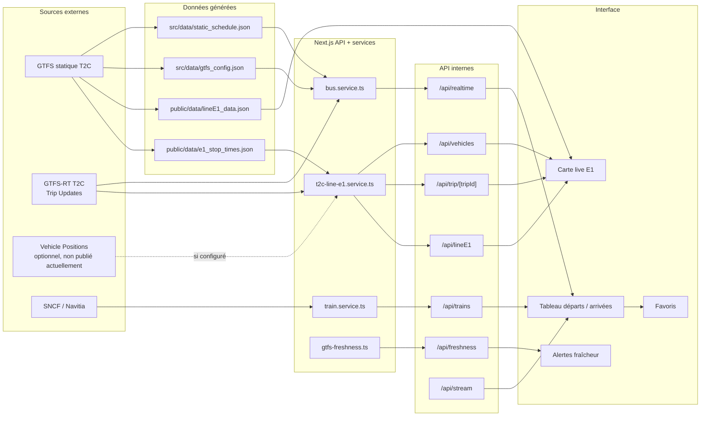
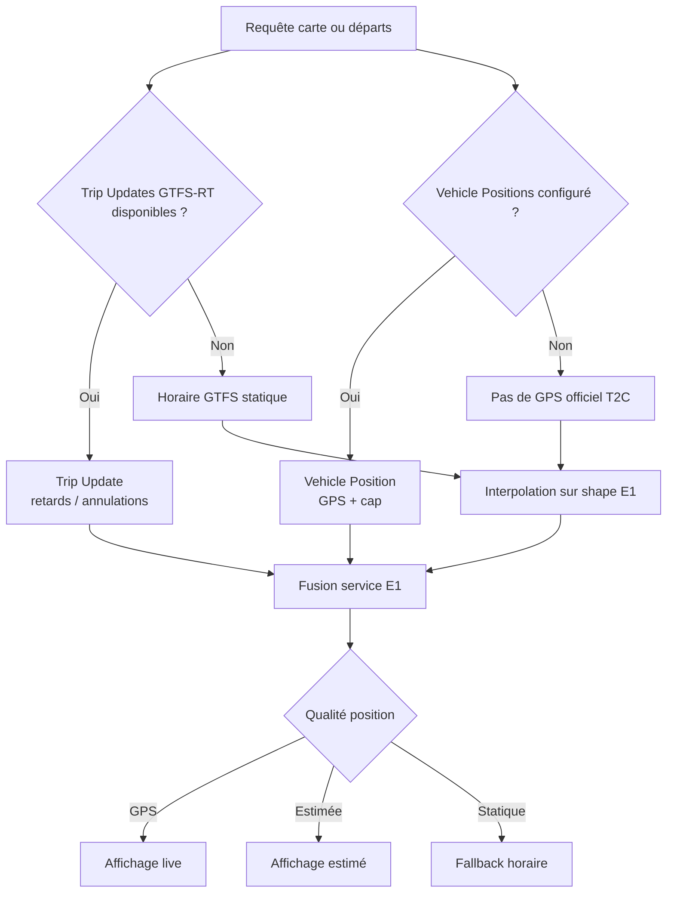
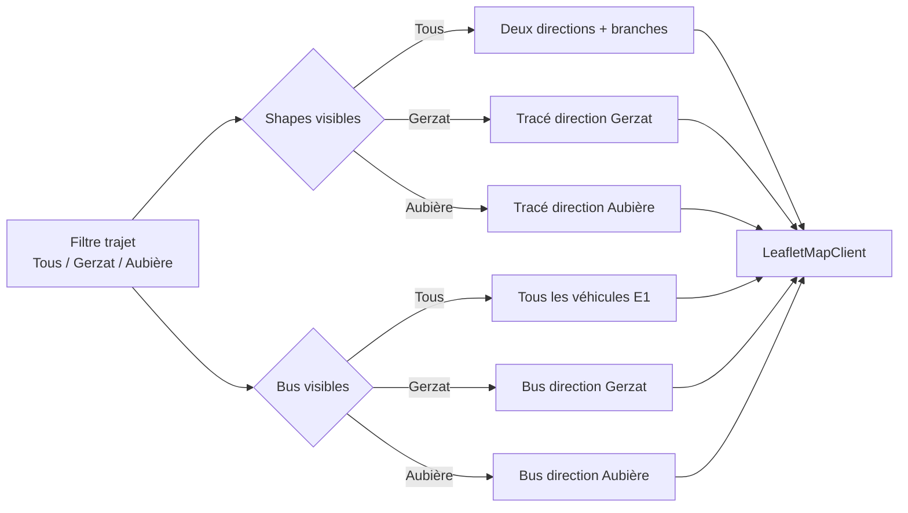

<div align="center">

# 🚉 Gerzat Live

**Consultez en un coup d'œil les prochains passages des bus T2C et des trains TER à Gerzat — départs, arrivées, carte live et favoris, en temps réel.**

[](https://github.com/nickdesi/BusTrainGerzat/actions/workflows/ci.yml)
[](https://github.com/nickdesi/BusTrainGerzat/releases)
[](https://gerzatlive.desimone.fr)
[](https://coolify.io/)
[](https://web.dev/progressive-web-apps/)
[](LICENSE)
[](#)
[](https://github.com/nickdesi/BusTrainGerzat/stargazers)
[](https://github.com/nickdesi/BusTrainGerzat/commits/main)
[](https://github.com/nickdesi/BusTrainGerzat/issues)
[](https://github.com/nickdesi/BusTrainGerzat/pulls)
[](SECURITY.md)


</div>

---

## 📋 Sommaire

- [✨ Objectif](#-objectif)
- [🚀 Démarrage rapide](#-démarrage-rapide)
- [📍 Arrêts et gare surveillés](#-arrêts-et-gare-surveillés)
- [🚀 Fonctionnalités](#-fonctionnalités)
- [🛠️ Stack technique](#️-stack-technique)
- [🧭 Architecture des données](#-architecture-des-données)
- [🔐 Variables d'environnement](#-variables-denvironnement)
- [📦 Installation locale](#-installation-locale)
- [🔧 Scripts utiles](#-scripts-utiles)
- [🧪 Tests et validation](#-tests-et-validation)
- [🔄 Mise à jour des données T2C](#-mise-à-jour-des-données-t2c)
- [✅ CI et qualité](#-ci-et-qualité)
- [🚢 Déploiement](#-déploiement)
- [🩺 Dépannage](#-dépannage)
- [📱 Installation mobile](#-installation-mobile)
- [🔒 Sécurité](#-sécurité)
- [📄 Licence](#-licence)
- [📋 Recommandations GitHub](#-recommandations-github)

## ✨ Objectif

Gerzat Live centralise les informations utiles avant un trajet depuis ou vers Gerzat : prochains départs, arrivées, bus T2C ligne E1, trains TER, favoris et carte live.

L'interface est mobile-first, sombre, lisible et pensée pour afficher immédiatement les informations prioritaires : horaire, retard, annulation, source temps réel et état de fraîcheur des données.

## 🚀 Démarrage rapide

> Prérequis : **Node.js >= 24.15.0** et une clé API **SNCF / Navitia** (pour les trains).

```bash
# 1. Cloner le projet
git clone https://github.com/nickdesi/BusTrainGerzat.git
cd BusTrainGerzat

# 2. Installer les dépendances
npm install

# 3. Configurer la clé SNCF (optionnel pour les bus, requis pour les trains)
echo "SNCF_API_KEY=votre_cle_api_sncf" > .env.local

# 4. Lancer le serveur de développement
npm run dev
```

Ouvrez ensuite `http://localhost:3000`. 🎉

## 📍 Arrêts et gare surveillés

| Transport | Arrêt / Gare | Ligne(s) |
| --- | --- | --- |
| 🚌 Bus T2C | **Gerzat Champfleuri** | Ligne E1, toutes directions |
| 🚌 Bus T2C Express | **Le Patural** | Ligne E1, direction Ballainvilliers |
| 🚆 Train TER | **Gare de Gerzat** | TER Auvergne |

## 🚀 Fonctionnalités

- 📋 **Tableau départs / arrivées** unifié bus + TER, avec statuts retard/avance/annulation et favoris persistants.
- 🗺️ **Carte live ligne E1** (Leaflet / React-Leaflet) : design « glass », filtre de direction **Tous / Gerzat / Aubière**, marqueurs vectoriels et HUD temps réel.
- 📡 **Temps réel GTFS-RT** : Trip Updates officiels T2C, interpolation et fallback horaire en cas de signal incomplet.
- 🚆 **Trains TER** via l'API SNCF / Navitia (Navitia).
- 💚 **Fraîcheur des données** : endpoint global et détection des données GTFS obsolètes.
- ⭐ **Favoris** synchronisés pour mettre en avant les trajets importants.
- 📱 **PWA** : installable sur iOS et Android, manifest + service worker.

## 🛠️ Stack technique

- **Framework** : Next.js 16, App Router
- **Langage** : TypeScript
- **UI** : React 19, Tailwind CSS v4
- **Données client** : TanStack Query
- **Carte** : Leaflet 1.9, React-Leaflet 5
- **Validation** : Zod
- **Tests** : Jest, Testing Library, Playwright
- **PWA** : manifest + service worker
- **Déploiement** : Coolify / Nixpacks

## 🧭 Architecture des données


```mermaid
flowchart LR
  subgraph Sources[Sources externes]
    T2CStatic[GTFS statique T2C]
    T2CRT["GTFS-RT T2C<br/>Trip Updates"]
    OptionalGPS["Vehicle Positions<br/>optionnel, non publié actuellement"]
    SNCF[SNCF / Navitia]
  end

  subgraph Data[Données générées]
    StaticSchedule["src/data/static_schedule.json"]
    GtfsConfig["src/data/gtfs_config.json"]
    LineE1Map["public/data/lineE1_data.json"]
    LineE1StopTimes["public/data/e1_stop_times.json"]
  end

  subgraph Server[Next.js API + services]
    BusService["bus.service.ts"]
    E1Service["t2c-line-e1.service.ts"]
    TrainService["train.service.ts"]
    Freshness["gtfs-freshness.ts"]
  end

  subgraph API[API internes]
    Realtime["/api/realtime"]
    Vehicles["/api/vehicles"]
    Trip["/api/trip/[tripId]"]
    Line["/api/lineE1"]
    Trains["/api/trains"]
    Fresh["/api/freshness"]
    Stream["/api/stream"]
  end

  subgraph UI[Interface]
    Board[Tableau départs / arrivées]
    Map[Carte live E1]
    Favorites[Favoris]
    Status[Alertes fraîcheur]
  end

  T2CStatic --> StaticSchedule
  T2CStatic --> GtfsConfig
  T2CStatic --> LineE1Map
  T2CStatic --> LineE1StopTimes
  T2CRT --> BusService
  T2CRT --> E1Service
  OptionalGPS -. si configuré .-> E1Service
  SNCF --> TrainService
  StaticSchedule --> BusService
  GtfsConfig --> BusService
  LineE1StopTimes --> E1Service
  LineE1Map --> Map
  BusService --> Realtime
  E1Service --> Vehicles
  E1Service --> Trip
  E1Service --> Line
  TrainService --> Trains
  Freshness --> Fresh
  Realtime --> Board
  Trains --> Board
  Vehicles --> Map
  Trip --> Map
  Line --> Map
  Stream --> Board
  Fresh --> Status
  Board --> Favorites
```

### Bus T2C

Gerzat Live combine plusieurs niveaux de données pour garder l'affichage exploitable même si un flux est incomplet :

1. **GTFS statique** : horaires planifiés, arrêts, routes, trips, shapes et fichiers générés.
2. **GTFS-RT Trip Updates officiel** : retards, annulations et prévisions temps réel.
3. **GTFS-RT Vehicle Positions optionnel** : positions GPS et cap uniquement si un flux officiel vérifié est configuré. À la vérification du 10 mai 2026, le dataset officiel T2C ne publie pas de ressource `VehiclePositions`.
4. **Fallback applicatif** : interpolation sur tracé E1 ou horaire théorique si un signal live manque.


```mermaid
flowchart TD
  Request[Requête carte ou départs] --> HasRealtime{Trip Updates GTFS-RT disponibles ?}
  HasRealtime -- Oui --> TripUpdate["Trip Update<br/>retards / annulations"]
  Request --> HasGps{Vehicle Positions configuré ?}
  HasGps -- Oui --> VehicleGPS["Vehicle Position<br/>GPS + cap"]
  HasGps -- Non --> NoGps[Pas de GPS officiel T2C]
  HasRealtime -- Non --> Static[Horaire GTFS statique]
  TripUpdate --> Merge[Fusion service E1]
  VehicleGPS --> Merge
  NoGps --> Interpolation
  Static --> Interpolation[Interpolation sur shape E1]
  Interpolation --> Merge
  Merge --> Confidence{Qualité position}
  Confidence -- GPS --> Live[Affichage live]
  Confidence -- Estimée --> Estimated[Affichage estimé]
  Confidence -- Statique --> Fallback[Fallback horaire]
```

### Carte live E1


```mermaid
flowchart LR
  Direction["Filtre trajet<br/>Tous / Gerzat / Aubière"] --> Shapes{Shapes visibles}
  Direction --> Buses{Bus visibles}
  Shapes -- Tous --> Both[Deux directions + branches]
  Shapes -- Gerzat --> North[Tracé direction Gerzat]
  Shapes -- Aubière --> South[Tracé direction Aubière]
  Buses -- Tous --> AllVehicles[Tous les véhicules E1]
  Buses -- Gerzat --> NorthVehicles[Bus direction Gerzat]
  Buses -- Aubière --> SouthVehicles[Bus direction Aubière]
  Both --> Leaflet[LeafletMapClient]
  North --> Leaflet
  South --> Leaflet
  AllVehicles --> Leaflet
  NorthVehicles --> Leaflet
  SouthVehicles --> Leaflet
```

## 🔐 Variables d'environnement

| Variable | Requise | Description |
| --- | --- | --- |
| `SNCF_API_KEY` | Oui pour les trains | Clé API SNCF/Navitia utilisée par les endpoints TER. |

Sans cette variable, les données TER SNCF/Navitia ne peuvent pas être récupérées.

## 📦 Installation locale

### Prérequis

- Node.js `>= 24.15.0` ;
- npm ;
- une clé API SNCF / Navitia pour les trains.

### Configuration trains

Créer `.env.local` à la racine du dépôt :

```bash
SNCF_API_KEY=votre_cle_api_sncf
```

## 🔧 Scripts utiles

| Commande | Description |
| :--- | :--- |
| `npm run dev` | Lance le serveur de développement Next.js. |
| `npm run build` | Compile l'application pour la production. |
| `npm run start` | Lance le serveur Next.js après un build. |
| `npm run lint` | Exécute ESLint. |
| `npm run test` | Exécute la suite Jest (tests unitaires). |
| `npm run test:e2e` | Exécute les tests Playwright (End-to-End). |
| `npm run gtfs:update` | Met à jour les données GTFS et régénère tous les fichiers JSON statiques. |

## 🧪 Tests et validation

Validation complète recommandée avant publication :

```bash
npm run lint
npm run test -- --runInBand
npm run test:e2e
npm run build
```

Les tests couvrent notamment :

- les helpers ligne E1 et la correspondance fuzzy des trip IDs ;
- les règles de filtrage/remplacement T2C ;
- la fraîcheur SNCF/Navitia ;
- les helpers de date, formatage, API client et interpolation véhicule.

## 📡 Sources de données

| Transport | Type | Source |
| --- | --- | --- |
| Bus T2C | GTFS-RT temps réel | transport.data.gouv.fr |
| Bus T2C | GTFS statique | Clermont Métropole Open Data |
| Train TER | API SNCF / Navitia | api.sncf.com |

## 🔄 Mise à jour des données T2C

Les données générées sont principalement :

- `gtfs_data/` : archive GTFS T2C extraite ;
- `src/data/static_schedule.json` : horaires statiques consommés par l'app ;
- `src/data/gtfs_config.json` : configuration arrêts/routes ;
- `public/data/lineE1_data.json` : arrêts officiels et tracés de la ligne E1 pour la carte ;
- `public/data/e1_stop_times.json` : trips et stop times E1 pour les détails de trajet.

Les scripts de mise à jour ont été migrés de Python vers TypeScript :

```bash
# Met à jour les données GTFS et génère tous les fichiers statiques JSON
npm run gtfs:update
```

Le workflow GitHub Actions `Update T2C GTFS Schedule` exécute automatiquement cette chaîne, valide les JSON générés, lance lint/tests/build, puis commit uniquement si les données changent.

## ✅ CI et qualité

Le workflow `CI` s'exécute sur `main` et sur les pull requests :

1. installation via `npm ci` ;
2. lint ESLint ;
3. tests Jest en série ;
4. build Next.js.

## 🚢 Déploiement

Le projet est compatible Coolify via `nixpacks.toml`.

Versions alignées :

- Node.js `24.15.0` en local, CI et Nixpacks ;
- Next.js `16.2.x` et React `19.2.x`.

Variables d'environnement requises en production :

```bash
SNCF_API_KEY=votre_cle_api_sncf
```

## 🩺 Dépannage

### Les trains ne s'affichent pas

Vérifier que `SNCF_API_KEY` est définie dans `.env.local` en développement et dans l'environnement de production.

### La carte E1 affiche des arrêts ou tracés obsolètes

Régénérer les données GTFS, puis vérifier `public/data/lineE1_data.json` et `public/data/e1_stop_times.json`.

### Le build échoue après une mise à jour de dépendances

Relancer une installation propre puis les validations :

```bash
npm install
npm run lint
npm run test -- --runInBand
npm run build
```

## 📱 Installation mobile

### iPhone / iPad

1. Ouvrir [gerzatlive.desimone.fr](https://gerzatlive.desimone.fr) dans Safari.
2. Appuyer sur **Partager**.
3. Choisir **Sur l'écran d'accueil**.
4. Valider avec **Ajouter**.

### Android

1. Ouvrir [gerzatlive.desimone.fr](https://gerzatlive.desimone.fr) dans Chrome.
2. Ouvrir le menu `⋮`.
3. Choiser **Installer l'application** ou **Ajouter à l'écran d'accueil**.
4. Confirmer.

## 🔒 Sécurité

Gerzat Live consomme des données publiques (GTFS-RT T2C, API SNCF/Navitia) et n'expose aucune donnée personnelle sensible. Pour signaler une faille de sécurité en privé, consultez [SECURITY.md](SECURITY.md).

## 📄 Licence

Projet personnel open source sous licence [MIT](LICENSE).

## 📋 Recommandations GitHub

> Note mainteneur — appliquées via `gh repo edit` :

- **Description suggérée :** `🚌 Bus T2C & trains TER en temps réel à Gerzat — départs, arrivées, carte live et favoris (Next.js + open data).`
- **Topics suggérés :** `nextjs`, `typescript`, `react`, `pwa`, `bus`, `train`, `realtime`, `transport`, `gtfs`, `gtfs-rt`, `sncf`, `navitia`, `t2c`, `open-data`, `auvergne-rhone-alpes`, `gerzat`, `leaflet`, `coolify`

---

<div align="center">

**Version 3.7.3** — Fait avec ❤️ à Gerzat.

</div>
