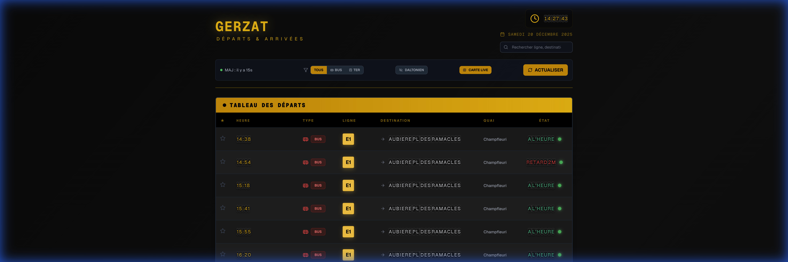
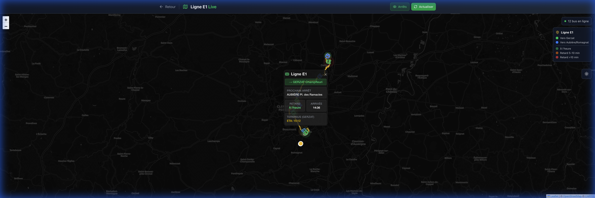
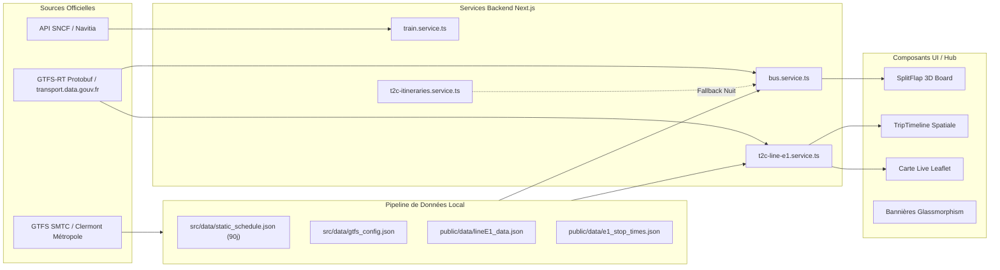

<div align="center">

# 🚉 Gerzat Live

**Hub multimodal en temps réel pour Gerzat — Bus T2C Ligne E1 & Trains TER SNCF.**

[](https://github.com/nickdesi/BusTrainGerzat/actions/workflows/ci.yml)
[](https://github.com/nickdesi/BusTrainGerzat/releases)
[](https://gerzatlive.desimone.fr)
[](https://coolify.io/)
[-black?style=for-the-badge&logo=next.js)](https://nextjs.org/)
[](https://react.dev/)
[](https://tailwindcss.com/)
[](LICENSE)

<br />

<p align="center">
  <a href="https://gerzatlive.desimone.fr"><strong>🌐 Accéder à l'application en ligne »</strong></a>
  <br />
  <a href="#-fonctionnalités-clés">Fonctionnalités</a> •
  <a href="#-démarrage-rapide">Démarrage</a> •
  <a href="#-architecture-des-données">Architecture</a> •
  <a href="#-mise-à-jour-gtfs-automatisée">Pipeline GTFS</a> •
  <a href="#-qualité--ci">Assurance Qualité</a>
</p>




</div>

---

## 📖 Présentation

**Gerzat Live** est une Progressive Web Application (PWA) conçue pour les habitants et usagers de Gerzat (Clermont Auvergne Métropole). Elle rassemble sur un tableau de bord lisible et contrasté tous les flux de mobilité en direct :

* 🚌 **Bus T2C Ligne E1 Express** : Départs en temps réel (GTFS-RT) aux arrêts stratégiques (*Champfleuri*, *Patural*).
* 🚆 **Trains TER SNCF** : Départs et arrivées en direct à la **Gare de Gerzat** (liaisons rapides vers Clermont-Ferrand en 7 min, Riom, Vichy, Moulins).
* 🗺️ **Carte interactive multimodale** : Visualisation GPS des bus en circulation, arrêts et tracés de lignes avec lueur néon haute lisibilité.
* 🛩️ **Afficheur mécanique Split-Flap 3D** : Rendu rétro-moderne avec perspective 3D, animation de bascule et micro-rebond mécanique.
* 📱 **PWA & Offline Ready** : Installable sur iPhone/Android avec service worker et mise en cache intelligente.

---

## 🚀 Fonctionnalités Clés

| Fonctionnalité | Description |
| :--- | :--- |
| **Tableau des Départs & Arrivées** | Affichage unifié bus + trains avec calcul dynamique des retards/avances et statuts temps réel. |
| **Split-Flap 3D Cockpit** | Afficheur mécanique d'aéroport/gare avec shaders CSS 3D et containment GPU anti-scintillement. |
| **Timeline de Trajet Spatiale** | Suivi dynamique du bus le long de son itinéraire avec onde radar pulsée (*ping live*) et statut arrêt par arrêt. |
| **Générateur GTFS Dynamique** | Découverte automatique des calendriers SMTC jusqu'à 90 jours d'avance pour éliminer tout risque d'expiration. |
| **Fallback SIV Intelligent** | Requête prédictive des premiers départs du lendemain matin lors des consultations tardives nocturnes. |
| **SEO & Google Rich Results** | Balisage Schema.org complet (`WebSite`, `WebApplication`, `TrainStation`, `BreadcrumbList`) et métadonnées géociblées. |

---

## 🛠️ Stack Technique

* **Framework** : [Next.js 16](https://nextjs.org/) (App Router, Turbopack, Standalone output)
* **Runtime** : [Node.js](https://nodejs.org/) `>= 24.15.0`
* **Interface & Styling** : [React 19](https://react.dev/), [Tailwind CSS v4](https://tailwindcss.com/), Lucide Icons
* **Design System** : *Gerzat Transit Hub* (Généré avec Stitch & `antigravity-design-expert`)
* **State & Data Fetching** : [TanStack Query v5](https://tanstack.com/query/latest)
* **Cartographie** : [Leaflet 1.9](https://leafletjs.com/), [React-Leaflet 5](https://react-leaflet.js.org/) (Tuiles sombres CartoDB Dark Matter)
* **Protobuf & Données** : `gtfs-realtime-bindings`, `protobufjs`, `csv-parse`, `adm-zip`
* **Qualité & Tests** : [Jest 30](https://jestjs.io/), [Testing Library](https://testing-library.com/), [ESLint](https://eslint.org/) (avec `eslint-plugin-security`)
* **Hébergement & Déploiement** : [Coolify](https://coolify.io/) sur Nixpacks / Docker

---

## 🧭 Architecture des Données


```mermaid
flowchart LR
  subgraph Sources[Sources Officielles]
    T2CStatic[GTFS SMTC / Clermont Métropole]
    T2CRT[GTFS-RT Protobuf / transport.data.gouv.fr]
    SNCF[API SNCF / Navitia]
  end

  subgraph Pipeline[Pipeline de Données Local]
    StaticSchedule["src/data/static_schedule.json (90j)"]
    GtfsConfig["src/data/gtfs_config.json"]
    LineE1Data["public/data/lineE1_data.json"]
    E1StopTimes["public/data/e1_stop_times.json"]
  end

  subgraph Core[Services Backend Next.js]
    BusService["bus.service.ts"]
    E1Service["t2c-line-e1.service.ts"]
    TrainService["train.service.ts"]
    ItinerariesService["t2c-itineraries.service.ts"]
  end

  subgraph UI[Composants UI / Hub]
    SplitFlap[SplitFlap 3D Board]
    Timeline[TripTimeline Spatiale]
    Map[Carte Live Leaflet]
    GlassAlerts[Bannières Glassmorphism]
  end

  T2CStatic --> Pipeline
  T2CRT --> BusService
  T2CRT --> E1Service
  SNCF --> TrainService
  Pipeline --> BusService
  Pipeline --> E1Service
  BusService --> SplitFlap
  E1Service --> Timeline
  E1Service --> Map
  ItinerariesService -. Fallback Nuit .-> BusService
```

---

## ⚡ Démarrage Rapide

### 1. Cloner le Dépôt
```bash
git clone https://github.com/nickdesi/BusTrainGerzat.git
cd BusTrainGerzat
```

### 2. Installer les Dépendances
```bash
npm install
```

### 3. Configurer l'Environnement
Créez un fichier `.env.local` à la racine :
```env
# Clé API SNCF / Navitia (pour le flux des trains TER en gare de Gerzat)
SNCF_API_KEY=votre_cle_api_sncf
```

### 4. Lancer en Mode Développement
```bash
npm run dev
```
Rendez-vous sur `http://localhost:3000`.

---

## 🔄 Mise à Jour GTFS Automatisée

Le dépôt intègre une chaîne TypeScript complète pour télécharger et compiler les données transport :

```bash
npm run gtfs:update
```

Cette commande exécute séquentiellement :
1. `scripts/gtfs/check_gtfs_update.ts` : Télécharge le GTFS SMTC avec timeout et retry exponentiel.
2. `scripts/gtfs/extract_lineE1_data.ts` : Extrait les tracés géographiques et arrêts de la ligne E1.
3. `scripts/gtfs/generate_e1_stop_times.ts` : Compile les horaires et trips détaillés.
4. `scripts/gtfs/generate_static_json.ts` : Découvre dynamiquement les calendriers et génère le fichier `static_schedule.json` (jusqu'à 90 jours).

### Workflow GitHub Actions Anti-Inactivité
Le workflow [`.github/workflows/update-gtfs.yml`](.github/workflows/update-gtfs.yml) tourne automatiquement deux fois par jour (`17 4,16 * * *`) et intègre un mécanisme de **Keepalive** pour empêcher la mise en sommeil des cron jobs GitHub Actions.

---

## 🧪 Qualité & CI

Chaque contribution est soumise à une **routine stricte de validation (Quality Gate)** :

```bash
# Vérification du linter (0 warning exigé)
npm run lint

# Suite de tests unitaires & intégration (72 tests)
npm test

# Build de production
npm run build
```

---

## 📱 Installation sur Smartphone (PWA)

* **iOS (Safari)** : Ouvrir [gerzatlive.desimone.fr](https://gerzatlive.desimone.fr) > Bouton *Partager* > **« Sur l'écran d'accueil »**.
* **Android (Chrome)** : Ouvrir le site > Menu `⋮` > **« Installer l'application »**.

---

## 📄 Licence & Auteur

Projet open-source sous licence [MIT](LICENSE).
Créé et maintenu avec passion par **[Nicolas De Simone](https://github.com/nickdesi)** à Gerzat (63360).
