# 🚉 Gerzat Live - Hub Multimodal

Application Next.js pour suivre en temps réel les bus T2C et les trains TER à Gerzat.

[](https://gerzatlive.desimone.fr)
[](https://github.com/nickdesi/BusTrainGerzat)
[](https://coolify.io/)

<div align="center">
  
  
</div>

## 📍 Arrêts surveillés

| Transport | Arrêt / Gare | Ligne(s) |
|-----------|--------------|----------|
| 🚌 Bus T2C | **Gerzat Champfleuri** | Ligne E1 (Toutes directions) |
| 🚌 Bus T2C (Express) | **Le Patural** | Ligne E1 (Uniquement Dir. Ballainvilliers) |
| 🚆 Train TER | **Gare de Gerzat** | TER Auvergne |

## 🚀 Fonctionnalités

### 🚌 Bus T2C (Ligne E1 - Arrêt Champfleuri)

- **Temps réel & Théorique** : Affichage précis des prochains passages avec distinction claire par badges de couleur.
- **Indicateurs de Retard** : Visualisation immédiate de l'état du trafic (À l'heure, En avance, Retard).
- **Directions Claires** : Séparation distincte entre les départs (Vers Aubière/Romagnat) et les arrivées (Terminus Gerzat).
- **Vue Unifiée (Gerzat)** : Intégration automatique des bus Express ("Patural", uniquement vers Ballainvilliers) et Standard ("Champfleuri") dans un seul tableau.
- **Fiabilité Stricte** : Calcul mathématique du retard (`Réel - Théorique`) pour ignorer les erreurs de l'API officielle (ex: retard annoncé à 0 minute alors que le bus est décalé de 5 minutes).

### 🚆 Trains TER (Gare de Gerzat)

- **Suivi en Direct** : Horaires des trains en temps réel via l'API SNCF officielle.
- **Double Sens** : Affichage séparé des trains vers Clermont-Ferrand et vers Riom/Moulins.
- **Horaires Détaillés** : Affichage de l'heure d'arrivée ET de départ pour chaque train à Gerzat.
- **Détails du Train** : Numéro de train et statut du retard en temps réel.
- **Trains Annulés** : Détection et affichage des trains supprimés avec statut "ANNULÉ" en rouge.

### 🗺️ Carte Live (Ligne E1)

- **Position GPS temps réel** : Affichage des positions réelles des bus via GTFS-RT Vehicle Positions.
- **Fallback intelligent** : Si GPS indisponible, interpolation avec les temps prédits (GTFS-RT Trip Updates).
- **Direction affichée** : 🟢 Vert = Vers Gerzat / 🔵 Bleu = Vers Aubière/Romagnat.
- **ETA au terminus** : Heure d'arrivée estimée au terminus pour chaque bus.
- **Prochain arrêt** : Nom de l'arrêt suivant et heure d'arrivée estimée.
- **Indicateur de retard** : Retard/avance affiché en temps réel dans le popup.

### ✨ Expérience Utilisateur (UX/UI & Accessibilité)

- **Design Glassmorphism** : Interface sombre élégante avec effets de flou et de transparence.
- **Recherche & Favoris** : Filtrage instantané et favoris granulaires par trajet spécifique (bus/train à une heure précise).
- **Notifications de retard** : Alertes push pour vos trajets favoris en retard (≥5 min).
- **Accessibilité WCAG 2.1 AA** : Conforme RGAA 4, contrastes ≥4.5:1, skip links, navigation clavier et attributs ARIA complets.

### 🧠 Intelligence Artificielle

- **Prédictions de Retard** : Badges "IA" indiquant les risques de retard basés sur l'historique (heures de pointe, sorties scolaires).
- **Alertes Intelligentes** : Bannière dynamique avertissant des perturbations probables sur vos trajets favoris dès l'ouverture.

### ⚡ Performance & Temps Réel

- **Server-Sent Events (SSE)** : Flux de données continu sans rechargement (plus de polling API).
- **Mises à jour Silencieuses** : Rafraîchissement instantané des horaires et statuts sans clignotement.
- **Cache Intelligent** : Stratégie network-first via Service Worker pour une PWA ultra-rapide.

## 🤖 Serveur MCP (IA & Automatisation)

Cette application expose un serveur **MCP (Model Context Protocol)** permettant aux agents IA (Claude Desktop, etc.) d'interagir directement avec les données de transport temps réel.

### Outils Disponibles

- `get_bus_positions` : Récupère les positions GPS, le cap et le retard de tous les bus en circulation.
- `get_departures` : Liste les prochains départs (Bus & Train) au hub de Gerzat.
- `get_line_status` : Donne un résumé de l'état du trafic (nombre de véhicules, retard moyen).

### Utilisation

```bash
# Lancer le serveur MCP (stdio transport)
npm run mcp
# ou
npx tsx src/mcp-server/index.ts
```

## 🛠 Architecture Technique

- **Framework** : Next.js 16 (App Router)
- **Styling** : TailwindCSS v4
- **State** : TanStack Query (React Query)

### 🧩 Hooks modulaires (v2.5.0)

| Hook | Responsabilité |
|------|----------------|
| `useBusData` | Fetch données bus GTFS-RT |
| `useTrainData` | Fetch données train SNCF |
| `useDeparturesModel` | Transformation & tri |
| `useDepartures` | Composition des hooks ci-dessus |
| `useFavorites` | Gestion des favoris (localStorage) |
| `useDelayNotifications` | Notifications push retards |

### 🧩 Services de données

| Service | Responsabilité |
|---------|----------------|
| `gtfs-rt.ts` | Service centralisé GTFS-RT (fetch, decode, types) |
| `api-client.ts` | Client HTTP avec retry (3 tentatives, backoff exponentiel) |
| `logger.ts` | Logger structuré (niveaux, contexte, métriques) |

### 📡 Sources de données

| Transport | API | Source |
|-----------|-----|--------|
| **Train TER** | API SNCF (Navitia) | [api.sncf.com](https://api.sncf.com) / [doc.navitia.io](https://doc.navitia.io) (clé requise) |
| **Bus T2C** | GTFS-RT temps réel | [transport.data.gouv.fr](https://proxy.transport.data.gouv.fr/resource/t2c-clermont-gtfs-rt-trip-update) |
| **Bus T2C** | GTFS statique | [opendata.clermontmetropole.eu](https://opendata.clermontmetropole.eu/api/v2/catalog/datasets/gtfs-smtc/alternative_exports/gtfs) |

### 🔄 Architecture des Données Bus GTFS-RT

Le système de gestion des données bus suit une architecture robuste qui combine les horaires statiques avec les mises à jour temps réel :

```mermaid
flowchart TD
    subgraph Sources["📡 Sources de Données"]
        GTFS_CONFIG["Config Dynamique<br/>(gtfs_config.json)"]
        GTFS_STATIC["GTFS Statique<br/>(static_schedule.json)"]
        E1_STOP_TIMES["Stop Times E1<br/>(e1_stop_times.json)"]
        GTFS_RT["GTFS-RT Trip Updates<br/>(transport.data.gouv.fr)"]
    end

    subgraph Processing["⚙️ Traitement (API Routes)"]
        GTFS_SERVICE["gtfs-rt.ts<br/>(service centralisé)"]
        FETCH["Fetch & Decode"]
        CHECK_DATA{"Données RT<br/>disponibles ?"}
        USE_RT["Utiliser RT"]
        USE_STATIC["Fallback Statique<br/>(e1_stop_times.json)"]
    end

    subgraph Classification["📊 Types de Trajets"]
        SCHEDULED["SCHEDULED (0)<br/>Trajet normal"]
        ADDED["ADDED (1)<br/>Trajet de remplacement"]
        NO_DATA["NO_DATA (2)<br/>Pas de prédiction"]
        CANCELED["CANCELED (3)<br/>Trajet annulé"]
    end

    subgraph Output["📤 Résultat Final"]
        COMBINE["Combiner & Trier"]
        DISPLAY["Affichage UI"]
    end

    GTFS_STATIC --> COMBINE
    E1_STOP_TIMES --> USE_STATIC
    GTFS_RT --> GTFS_SERVICE --> FETCH --> CHECK_DATA
    CHECK_DATA -->|"Oui (arrival.time)"| USE_RT --> COMBINE
    CHECK_DATA -->|"Non (NO_DATA)"| USE_STATIC --> COMBINE
    COMBINE --> DISPLAY
```



#### Logique de Matching RT/Statique

```mermaid
flowchart LR
    subgraph Input["Entrée"]
        STATIC["Horaire Statique<br/>(tripId, date)"]
        RT["Données RT<br/>(tripId, startDate)"]
    end

    subgraph Validation["Validation"]
        CHECK_DATE{"startDate<br/>disponible ?"}
        DATE_MATCH{"Dates<br/>correspondent ?"}
        TIME_CHECK{"Fenêtre<br/>4h ?"}
    end

    subgraph Result["Résultat"]
        APPLY["✅ Appliquer RT<br/>(retard, annulation)"]
        SKIP["⏭️ Ignorer RT"]
    end

    STATIC --> CHECK_DATE
    RT --> CHECK_DATE
    CHECK_DATE -->|Oui| DATE_MATCH
    CHECK_DATE -->|Non| TIME_CHECK
    DATE_MATCH -->|Oui| APPLY
    DATE_MATCH -->|Non| SKIP
    TIME_CHECK -->|Oui| APPLY
    TIME_CHECK -->|Non| SKIP
```



#### Positions Véhicules (Carte Live)

L'API `/api/vehicles` utilise un système de priorité à 3 niveaux pour afficher la position la plus précise possible :

```mermaid
flowchart TD
    subgraph Sources["📡 Sources GTFS-RT"]
        VP["Vehicle Positions<br/>(GPS réel)"]
        TU["Trip Updates<br/>(temps prédits)"]
        STATIC["Static Schedule<br/>(horaires théoriques)"]
    end

    subgraph Priority["🎯 Priorité de Résolution"]
        P1{"GPS<br/>disponible ?"}
        P2{"RT Delay<br/>disponible ?"}
        P3["Interpolation<br/>Théorique"]
    end

    subgraph Position["📍 Position Finale"]
        GPS_POS["Position GPS<br/>✅ Précision max"]
        RT_POS["Interpolation RT<br/>⚡ Ajustée au retard"]
        STATIC_POS["Interpolation Static<br/>📅 Horaire théorique"]
    end

    VP --> P1
    P1 -->|Oui| GPS_POS
    P1 -->|Non| P2
    TU --> P2
    P2 -->|Oui| RT_POS
    P2 -->|Non| P3
    STATIC --> P3 --> STATIC_POS
```



| Priorité | Source | Précision | Cas d'usage |
|----------|--------|-----------|-------------|
| 1 | GTFS-RT Vehicle Positions | GPS réel | Bus équipés GPS transmettant en temps réel |
| 2 | GTFS-RT Trip Updates | Interpolation ajustée | GPS non dispo, mais retard/avance connu |
| 3 | Static Schedule | Interpolation théorique | Aucune donnée temps réel |

#### Gestion des Schedule Relationships

**TripDescriptor (niveau trajet) :**

| Code | Nom | Description | Traitement |
|------|-----|-------------|------------|
| `0` | SCHEDULED | Trajet planifié normal | Mis à jour avec données RT |
| `1` | ADDED | Trajet ajouté (remplacement) | Créé dynamiquement |
| `2` | UNSCHEDULED | Trajet sans horaire fixe | Traité comme ADDED |
| `3` | CANCELED | Trajet annulé | Marqué "ANNULÉ" en rouge |

**StopTimeUpdate (niveau arrêt) :**

| Code | Nom | Description | Traitement |
|------|-----|-------------|------------|
| `0` | SCHEDULED | Arrêt planifié | Utilise temps RT |
| `1` | SKIPPED | Arrêt sauté | Non affiché |
| `2` | NO_DATA | Pas de prédiction | **Fallback sur horaire statique** |

## 📦 Installation

1. **Installer les dépendances** :

    ```bash
    npm install
    ```

2. **Configurer les variables d'environnement** :

    ```bash
    # Créer le fichier .env.local
    echo "SNCF_API_KEY=votre_clé_api_sncf" > .env.local
    ```

    > Obtenez votre clé sur [digital.sncf.com](https://www.digital.sncf.com/startup/api)

3. **Lancer le serveur de développement** :

    ```bash
    npm run dev
    ```

4. **Accéder à l'application** :
    Ouvrir [http://localhost:3000](http://localhost:3000) dans votre navigateur.

## 🔧 Scripts Utiles

- **Build** : `npm run build` (Utilise Webpack pour la compatibilité PWA).
- **Mise à jour Bus (Manuelle)** :

  ```bash
  python3 generate_static_json.py
  ```

- **Mise à jour Train (Manuelle)** :

  ```bash
  python3 generate_train_static.py
  ```

## 🔄 Mise à jour automatique

Les horaires de bus T2C sont vérifiés **automatiquement chaque lundi** à 7h00 (heure de Paris) via GitHub Actions :

- **Mise à jour automatique** : Le script force désormais la synchronisation avec les dernières données officielles disponibles sur le portail Open Data.
- **Source unique** : Aucune correction manuelle n'est appliquée, l'application reflète fidèlement les données GTFS fournies par Clermont Métropole.

### Scripts disponibles

```bash
# Régénérer les horaires statiques depuis GTFS officiel
python3 generate_static_json.py

# Extraire les données géographiques (tracé, arrêts) pour la carte live
python3 extract_lineE1_data.py

# Vérifier si les données officielles sont à jour
python3 scripts/check_gtfs_update.py
```

> **Note** : Les données GTFS sont téléchargées automatiquement depuis [opendata.clermontmetropole.eu](https://opendata.clermontmetropole.eu/explore/dataset/gtfs-smtc).

Vous pouvez aussi déclencher la mise à jour manuellement depuis [GitHub Actions](https://github.com/nickdesi/BusTrainGerzat/actions).

## 📱 Installer l'Application sur Mobile

L'application peut être installée comme une app native sur votre téléphone !

### 🍎 iPhone / iPad

1. Ouvrez **Safari** et allez sur [gerzatlive.desimone.fr](https://gerzatlive.desimone.fr)
2. Appuyez sur l'icône **Partager** (carré avec flèche vers le haut)
3. Faites défiler et appuyez sur **« Sur l'écran d'accueil »**
4. Nommez l'app (ex: "Gerzat Live") et appuyez sur **Ajouter**

### 🤖 Android

1. Ouvrez **Chrome** et allez sur [gerzatlive.desimone.fr](https://gerzatlive.desimone.fr)
2. Appuyez sur les **3 points** en haut à droite
3. Appuyez sur **« Installer l'application »** ou **« Ajouter à l'écran d'accueil »**
4. Confirmez l'installation

Une fois installée, l'application apparaît sur votre écran d'accueil avec sa propre icône et fonctionne comme une app native !
